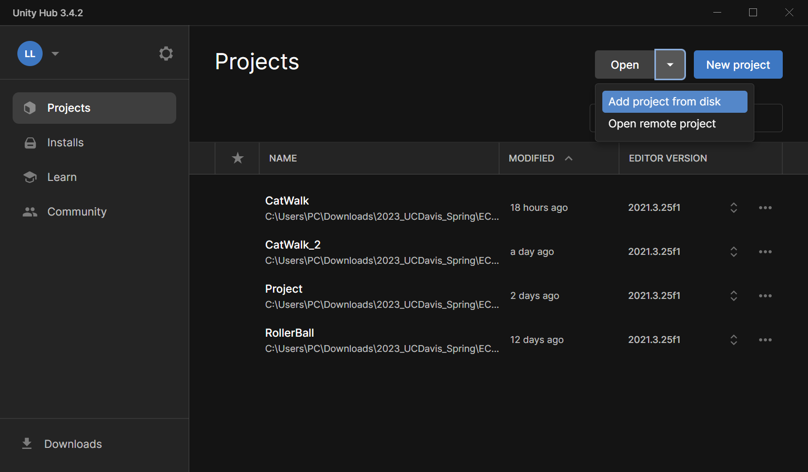

# CatWalk
Reinforcement learning for cat walking motion through Unity ML-Agents Toolkit
## Getting Started
-  Clone this repository
-  In Unity Hub, select open project from disk and open the cloned folder "CatWalk" 

I've tested and this works on my computer. The versions shouldn't affect too much but I am using Unity 2021.3.24f1.

🔔 Start an individual branch before modifying anything so that we don't mess up each others work.

