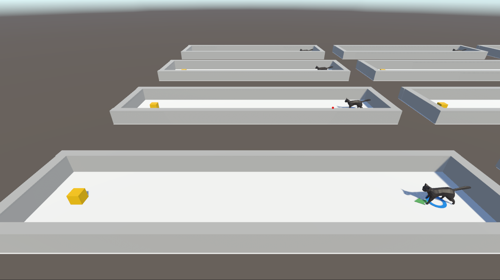

# CatWalk

**Reinforcement learning for cat walking motion through Unity ML-Agents Toolkit**
## Install Environment

 - Installation page: https://github.com/Unity-Technologies/ml-agents/blob/release_10_docs/docs/Installation.md
 - Starting guide: https://github.com/Unity-Technologies/ml-agents/blob/release_10_docs/docs/Getting-Started.md

Or follow these instructions

1. Get python 3.8: https://www.python.org/downloads/release/python-3810/

2. Go to project folder

3. `py -3.8 -m venv venv`
`venv\Scripts\activate`
`pip3 install torch==1.7.0 -f https://download.pytorch.org/whl/torch_stable.html`
`pip3 install mlagents`

4. For [Pillow, grpcio, h5py], do:
`pip3 uninstall [package]`
`pip3 install [package] --upgrade`

5. `pip3 install protobuf==3.20.*`
`pip3 install numpy==1.21.2`

6. Try: `mlagents-learn --help`
     -this should display a help screen properly

## Open CatWalk project
7. Clone this repository

8. In Unity Hub, select open project from disk and open the cloned CatWalk folder

9. Go to 'Prefab' and select 'cat_stand'

10. Go to 'TFModels' and drag the approprate .onnx model file into the Model parameter of the cat_stand. It should be under 'Behavioral Parameters'

11. Now just press play and the model will do what it was trained

## To train in Unity

- Use command `mlagents-learn CatWalk/config/CatWalk.yaml --run-id=catWalk`
then press play in Unity

- Use command `tensorboard --logdir results`to observing training progress

## To run on executable (for faster training):

First, must create executable by building project, and adding to a folder (like CatWalk_Build3), then access executable using that folder like as shown below

- Run multi env no graphics
`mlagents-learn CatWalk/config/CatWalk.yaml --run-id=catWalk_stand_3 --env=Builds/CatWalk_Build_StandOnly_3 --num-envs=8 --torch-device cuda --no-graphics --resume`

- Display 1 window
`mlagents-learn CatWalk/config/CatWalk.yaml --run-id=catWalk_stand_3 --env=Builds/CatWalk_Build_StandOnly_3 --num-envs=1 --torch-device cuda --width 1200 --height 800 --resume`
